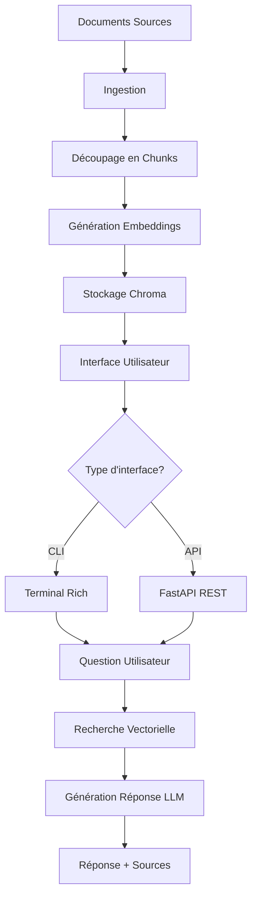

# 🤖 QA Local - Chatbot RAG Local

[](https://python.org)
[](https://fastapi.tiangolo.com)
[](https://langchain.com)
[](https://ollama.ai)
[](LICENSE)

Un système de questions-réponses intelligent basé sur **RAG** (Retrieval-Augmented Generation) qui utilise des modèles locaux avec Ollama. Interrogez vos documents PDF, TXT et Markdown de manière conversationnelle, sans dépendre de services cloud externes.


## 🌟 Fonctionnalités

- 🔍 **RAG Local** - Recherche intelligente dans vos documents
- 📚 **Multi-formats** - Support PDF, TXT, Markdown
- 🖥️ **Interface CLI** - Terminal interactif avec Rich UI
- 🌐 **API REST** - Endpoints FastAPI pour intégration
- 🧠 **Ollama Integration** - Modèles LLM locaux (Mistral, Llama, etc.)
- 💾 **Base vectorielle** - Stockage persistant avec Chroma
- 🎯 **Recherche précise** - Récupération de documents pertinents
- 🔧 **Configurable** - Variables d'environnement flexibles

## 🏗️ Architecture

```
qa_local/
├── 📁 data/           # Documents sources (PDF, TXT, MD)
├── 📁 index/          # Index vectoriel Chroma (généré)
├── 📄 api.py          # API REST FastAPI
├── 📄 ingest.py       # Script d'ingestion des documents
├── 📄 qa_cli.py       # Interface en ligne de commande
├── 📄 utils.py        # Utilitaires de traitement
└── 📄 README.md       # Ce fichier
```

## 🚀 Installation Rapide

### Prérequis

- Python 3.8+
- [Ollama](https://ollama.ai) installé localement

### 1. Installation d'Ollama

```bash
# Linux/Mac
curl -fsSL https://ollama.ai/install.sh | sh

# Démarrer Ollama
ollama serve
```

### 2. Installation des modèles

```bash
# Modèle d'embedding (requis)
ollama pull nomic-embed-text

# Modèle de génération (recommandé)
ollama pull mistral:7b-instruct
```

### 3. Configuration du projet

```bash
# Cloner le projet
git clone <votre-repo>/qa_local.git
cd qa_local

# Créer l'environnement virtuel
python -m venv venv
source venv/bin/activate  # Linux/Mac
# ou
venv\Scripts\activate     # Windows

# Installer les dépendances
pip install -r requirements.txt
```

## 📦 Dépendances

Créez un fichier `requirements.txt` :

```txt
fastapi>=0.100.0
uvicorn[standard]>=0.20.0
langchain>=0.1.0
langchain-community>=0.0.10
langchain-ollama>=0.1.0
chromadb>=0.4.0
pypdf>=3.0.0
rich>=13.0.0
pydantic>=2.0.0
python-multipart>=0.0.6
```

## 🔧 Configuration

Créez un fichier `.env` (optionnel) :

```env
# Répertoires
DATA_DIR=data
INDEX_DIR=index

# Modèles Ollama
EMBED_MODEL=nomic-embed-text
LLM_MODEL=mistral:7b-instruct

# Configuration RAG
COLLECTION=qa_local
TOP_K=4
```

## 📚 Utilisation

### 1. Préparer vos documents

Placez vos documents dans le dossier `data/` :

```bash
mkdir -p data
cp mes_documents.pdf data/
cp guide.txt data/
cp notes.md data/
```

### 2. Indexer les documents

```bash
python ingest.py
```

**Sortie attendue :**
```
🚀 Début de l'ingestion des documents
✅ 15 documents chargés  
✅ 127 chunks créés
🎉 Indexation terminée!
📊 127 documents dans la collection 'qa_local'
```

### 3. Interface en ligne de commande

```bash
python qa_cli.py
```

**Fonctionnalités CLI :**
- ❓ Posez vos questions naturellement
- `/stats` - Statistiques de la base
- `/help` - Aide et commandes
- `/clear` - Effacer l'écran
- `Ctrl+C` - Quitter

### 4. API REST

```bash
uvicorn api:app --reload --host 0.0.0.0 --port 8000
```

**Endpoints disponibles :**

| Endpoint | Méthode | Description |
|----------|---------|-------------|
| `/qa` | POST | Question-Réponse principale |
| `/health` | GET | État de santé de l'API |
| `/collections` | GET | Statistiques de la collection |
| `/docs` | GET | Documentation Swagger |

**Exemple d'usage :**

```bash
curl -X POST "http://localhost:8000/qa" \
  -H "Content-Type: application/json" \
  -d '{"question": "Quel est le sujet principal du document?"}'
```

**Réponse JSON :**
```json
{
  "answer": "Le document traite principalement de...",
  "sources": ["document1.pdf", "guide.txt"]
}
```

## 🔄 Workflow Complet



## 🎯 Exemples d'Usage

### Questions Simples
```
❓ Qu'est-ce que l'intelligence artificielle ?
❓ Résume le contenu du rapport financier
❓ Quelles sont les étapes du processus ?
```

### Questions Complexes
```
❓ Compare les approches mentionnées dans les documents
❓ Quels sont les avantages et inconvénients listés ?
❓ Donne-moi les chiffres clés du dernier trimestre
```

## 🛠️ Personnalisation

### Changer de modèle LLM

```bash
# Installer un nouveau modèle
ollama pull llama3:8b

# Modifier la variable d'environnement
export LLM_MODEL=llama3:8b

# Ou dans le .env
LLM_MODEL=llama3:8b
```

### Ajuster les paramètres RAG

```python
# Dans api.py ou qa_cli.py
TOP_K = 6  # Plus de documents récupérés
temperature = 0.1  # Réponses plus conservatrices
chunk_size = 1000  # Chunks plus grands
```

### Formats supportés

| Format | Extension | Loader |
|--------|-----------|---------|
| PDF | `.pdf` | PyPDFLoader |
| Texte | `.txt` | TextLoader |
| Markdown | `.md` | TextLoader |

## 🐛 Dépannage

### Problème : Ollama non accessible
```bash
# Vérifier qu'Ollama fonctionne
ollama list
curl http://localhost:11434/api/tags
```

### Problème : Modèles manquants
```bash
ollama pull nomic-embed-text
ollama pull mistral:7b-instruct
```

### Problème : Index corrompue
```bash
# Supprimer et recréer l'index
rm -rf index/
python ingest.py
```

### Problème : Mémoire insuffisante
```python
# Réduire la taille des chunks dans utils.py
chunk_size = 400
chunk_overlap = 50
```

## 📊 Métriques et Monitoring

### Statistiques via CLI
```bash
python qa_cli.py
> /stats
```

### API Health Check
```bash
curl http://localhost:8000/health
```

### Monitoring Ollama
```bash
# Utilisation GPU/CPU
ollama ps
```

## 🤝 Contribution

1. **Fork** le projet
2. Créer une **branche feature** (`git checkout -b feature/amelioration`)
3. **Commit** vos changements (`git commit -am 'Ajout fonctionnalité'`)
4. **Push** sur la branche (`git push origin feature/amelioration`)
5. Créer une **Pull Request**

## 🔮 Roadmap

- [ ] 🌐 Interface Web avec Streamlit/Gradio
- [ ] 📄 Support Word/PowerPoint
- [ ] 🔍 Recherche hybride (vectorielle + full-text)
- [ ] 👥 Gestion multi-utilisateurs
- [ ] 📈 Analytics et métriques avancées
- [ ] 🎨 Thèmes et personnalisation UI
- [ ] 🔄 Synchronisation dossiers automatique

## 📝 Changelog

### v2.0.0 (2024-08-27)
- ✨ Interface CLI enrichie avec Rich
- 🔧 API FastAPI complète
- 🛡️ Gestion d'erreurs robuste
- 📊 Commandes statistiques
- 🎯 Validation des paramètres

### v1.0.0 (Initial)
- 🏗️ Architecture RAG de base
- 📚 Ingestion PDF/TXT
- 🤖 Integration Ollama
- 💾 Stockage Chroma

## 📄 Licence

Ce projet est sous licence **MIT**. Voir le fichier [LICENSE](LICENSE) pour plus de détails.

## ⭐ Support

Si ce projet vous aide, pensez à lui donner une ⭐ !

**Créé avec ❤️ par **

---

*QA Local - Votre assistant intelligent pour interroger vos documents en local, sans cloud, sans compromis sur la confidentialité.*
